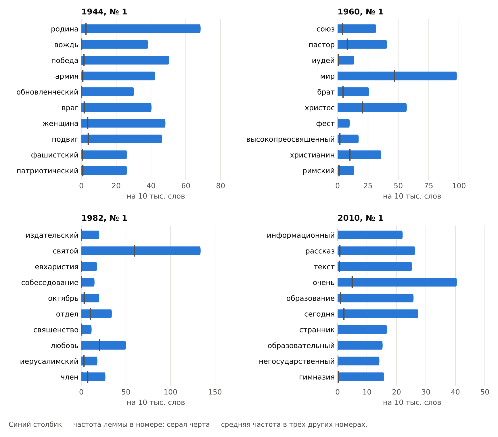
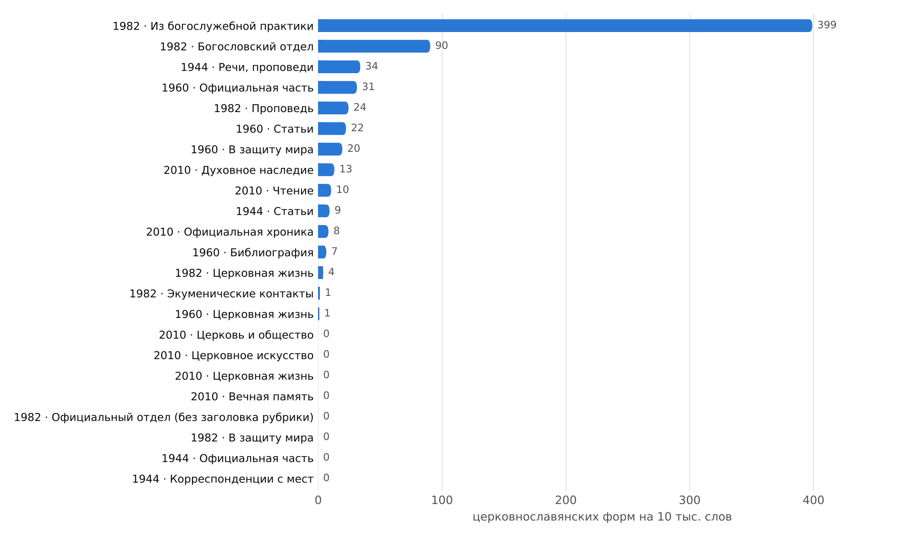
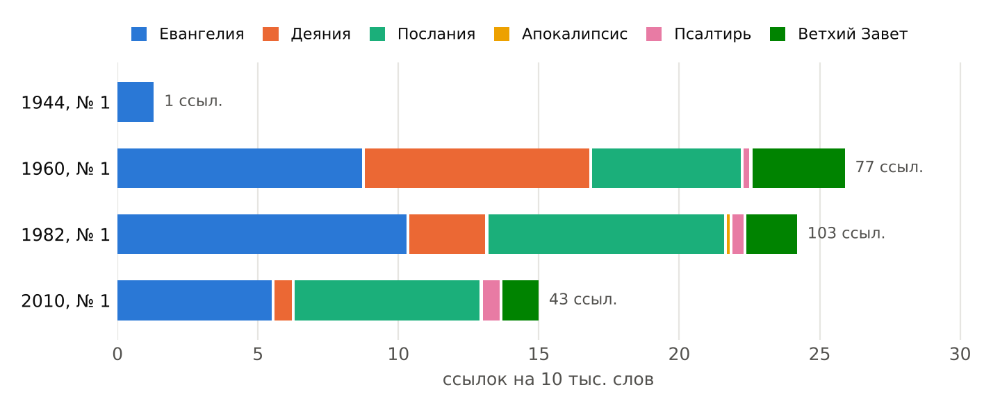
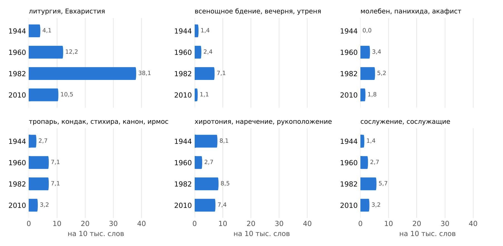
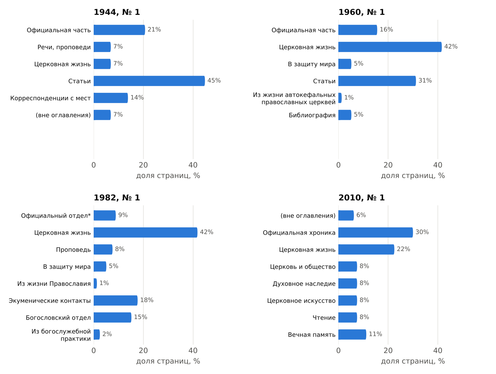
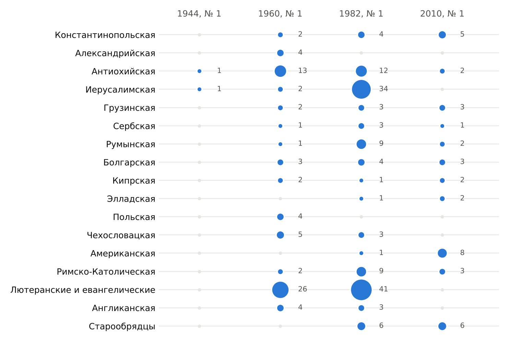
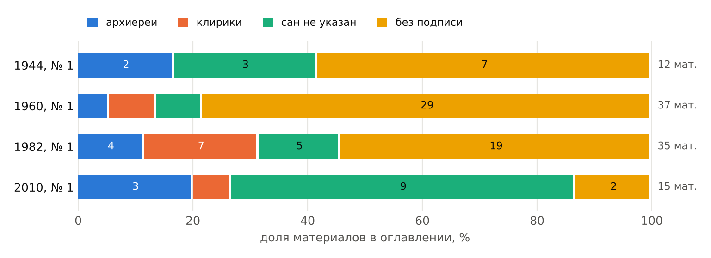

## Введение

«Журнал Московской Патриархии» (ЖМП) издаётся с 1931 года, с перерывом в 1935–1943 годах. Согласно описанию на сайте журнала, в советский период он долгое время оставался единственным церковным печатным органом, относительно доступным для верующих. На его страницах публиковались постановления Священного Синода, послания и указы Патриарха, проповеди, хроника церковной жизни в епархиях и за рубежом, богословские и церковно-исторические исследования. Комплект журнала за девять десятилетий составляет непрерывную летопись церковной жизни.

В научной литературе ЖМП рассматривается прежде всего как исторический источник. Изучены отдельные периоды и темы: номера военных лет [[4]](#lit-4), отражение в журнале взаимоотношений церковного и общественного самосознания в 1940–1980-е годы [[5]](#lit-5), история Троице-Сергиевой лавры по материалам журнала [[1]](#lit-1). Описаны типологические особенности ЖМП как официального общецерковного издания [[6]](#lit-6). Эти работы опираются на выборочное чтение номеров. Сплошного описания языка и жанрового состава журнала за весь период издания при предварительном поиске литературы обнаружить не удалось.

Корпусный подход позволяет рассмотреть журнал целиком: подсчитать, сопоставить и проверить на всём материале наблюдения, которые при выборочном чтении остаются частными. Ниже показано, какие вопросы можно ставить к такому корпусу. Материалом служат четыре январских номера разных десятилетий. Все приведённые цифры иллюстрируют метод и не претендуют на выводы о периодах (см. раздел [Ограничения](#ограничения)).

## Материал и обработка

Для пробы взяты первые номера за 1944, 1960, 1982 и 2010 годы. Три номера доступны в виде сканов, номер 2010 года — в виде электронной вёрстки с текстовым слоем.

| Номер | Источник | Страниц с текстом | Слов | Ошибки распознавания |
|:---|:---|--:|--:|:---|
| 1944, № 1 | скан 600 dpi | 28 | 7 379 | 1,2 % слов |
| 1960, № 1 | скан 150 dpi | 71 | 29 629 | 0,5 % слов |
| 1982, № 1 | скан 150 dpi | 79 | 42 272 | 4,4 % слов (2,8 % после словарной правки) |
| 2010, № 1 | электронная вёрстка | 77 | 28 452 | распознавание не требуется |
| **Всего** | | **255** | **107 732** | |

: Состав пробного корпуса. Доля ошибок измерена на эталонных фрагментах объёмом от 249 до 424 слов, расшифрованных вручную. {#tbl-material}

Обработка включала следующие шаги.

1. **Распознавание сканов** программой Tesseract [[9]](#lit-9) с моделью только для русского языка. Готовый текстовый слой номера 1944 года, созданный со смешанной русско-английской моделью, содержал около 10 % ошибочных слов и был заменён.
2. **Очистка**: удалены колонцифры, сигнатуры, подписи к иллюстрациям, колонтитулы, выходные данные и оглавления; восстановлены слова, разорванные переносом. В номере 2010 года роли текстовых блоков (основной текст, подпись, колонтитул, выносная цитата) определялись по шрифту.
3. **Привязка к оглавлению**: каждая страница соотнесена с печатной пагинацией и с рубрикой, заглавием и автором материала по оглавлению номера.
4. **Морфологический анализ** анализатором pymorphy3 [[8]](#lit-8): лемматизация и проверка слов по словарю современного русского языка.

В номере 1982 года мелкий кегль при разрешении скана 150 dpi привёл к систематической путанице букв «и» и «н». Словарная правка снизила долю ошибок с 4,4 до 2,8 %, но имена собственные она не исправляет.

## Язык

### Характерная лексика номеров

Для каждого номера вычислены леммы, частота которых в нём значимо выше, чем в трёх остальных номерах (статистика G² [[7]](#lit-7)). Имена собственные исключены; им посвящён раздел [Корпус как справочный инструмент](#корпус-как-справочный-инструмент).

{#fig-keywords}

Характерная лексика отражает прежде всего состав конкретного номера. В номере 1944 года это лексика военного времени (*родина*, *победа*, *армия*, *подвиг*) и слово *обновленческий*, связанное с материалом о воссоединении обновленческого духовенства с Православной Церковью. В 1960 году выделяются *пастор*, *брат*, *христианин* (материалы о пребывании в СССР делегации евангелических пасторов) и лексика статьи о суде над апостолом Павлом (*иудей*, *римский*, *Фест*). В 1982 году — *Евхаристия* и *любовь* (статья митрополита Вениамина «Мысли о Литургии верных»), *собеседование* и *священство* (материалы богословского собеседования «Арнольдсхайн-IX»), *издательский* (освящение здания Издательского отдела). В 2010 году — *образование*, *гимназия*, *негосударственный* (статья о православных школах), *рассказ* и *странник* (исследование об «Откровенных рассказах странника»), а также *очень* и *сегодня*, свойственные устной речи интервью.

Отсюда методическое следствие для полного корпуса: сравнивать периоды без учёта жанра нельзя. Один крупный материал меняет словарь номера сильнее, чем смена десятилетия. Сопоставление должно идти внутри жанров: хроника с хроникой, проповедь с проповедью.

### Церковнославянский слой

Тексты ЖМП набраны гражданской печатью, но содержат церковнославянские цитаты из Писания и богослужения, а также отдельные церковнославянские формы в авторской речи. Для их автоматического выявления использованы два правила:

- служебные и местоименные слова, отсутствующие в современном русском языке: *яко*, *иже*, *аще*, *паки*, *бо*, *мя*, *тя*, *ны* и др.;
- формы, которых нет в словаре современного русского языка, но которые после замены окончания на русское соответствие в словаре находятся: *милостию* → *милостью*, *приносити* → *приносить*, *святыя* → *святой*, *явися* → *явился*.

Второе правило отсекает опечатки распознавания и имена собственные, поскольку у них русского соответствия нет. Церковные формы, вошедшие в современный книжный язык (*Божия*, *ныне*, *дабы*), не учитываются. Метод даёт заниженную, но надёжную оценку. Справочной базой для его уточнения может служить церковнославянский подкорпус Национального корпуса русского языка с частотным словарём [[3]](#lit-3) и «Большой словарь церковнославянского языка Нового времени» [[2]](#lit-2).

{#fig-slavonic}

В целом по номерам на 10 тысяч слов приходится 8,1 (1944), 13,2 (1960), 30,0 (1982) и 4,9 (2010) церковнославянских форм. Распределение по рубрикам показывает, что эта величина зависит прежде всего от жанра. В номере 1982 года формы сосредоточены в рубриках «Из богослужебной практики» (399 на 10 тысяч слов) и «Богословский отдел» (90): обе содержат толкование богослужебных текстов с обширными цитатами. В хронике, официальных документах и материалах о межцерковных связях церковнославянских форм почти нет.

Характерно, что один и тот же стих может приводиться в разных языковых формах. В номере 1960 года ангельская песнь Рождества (Лк. 2, 14) цитируется и по-церковнославянски («и на земли мир, в человецех благоволение»), и по Синодальному переводу («и на земле мир, в человеках благоволение»). Выбор между ними может зависеть от жанра, автора и адресата текста, и это отдельный вопрос для исследования на полном корпусе.

Полученные цифры для 1982 года, по-видимому, занижены: знаки ударения в богослужебных текстах при распознавании превращаются в другие буквы («све́том» → «свётом»), и такие формы правилами не опознаются.

### Речевой этикет

Церковная титулатура и формулы обращения составляют устойчивую часть языка журнала. В таблице приведена частота отдельных формул на 10 тысяч слов.

| Формула | 1944 | 1960 | 1982 | 2010 |
|:---|--:|--:|--:|--:|
| *Святейший* (все формы) | 42,0 | 12,8 | 38,1 | 31,6 |
| *Блаженнейший* | 4,1 | 6,1 | 17,5 | 2,1 |
| *Высокопреосвященнейший*, *Высокопреосвященство* | 0,0 | 12,2 | 5,4 | 0,7 |
| *Преосвященный*, *Преосвященство* | 0,0 | 6,1 | 2,1 | 3,2 |
| «Патриарх Московский и всея Руси» | 2,7 | 3,0 | 6,4 | 9,8 |
| «Ваше Святейшество», «Ваше Блаженство» | 6,8 | 1,4 | 3,1 | 4,2 |

: Частота формул титулования на 10 тысяч слов. {#tbl-etiquette}

Частота титулов следует за содержанием номера: высокая частота формы *Блаженнейший* в 1982 году объясняется визитом Патриарха Иерусалимского Диодора, высокая частота титулов архиереев в 1960 году — преобладанием официальной переписки. Полный патриарший титул в 2010 году встречается в три с лишним раза чаще, чем в 1944 и 1960 годах. Проверить, устойчива ли эта разница, можно только на полном корпусе.

### Слово «мир»

Слово *мир* употребляется в журнале в двух значениях: «покой, согласие» и «вселенная, человечество». Распределение значений по номерам различается.

| Номер | Употреблений | Наиболее частые соседние слова |
|:---|--:|:---|
| 1944 | 8 | — |
| 1960 | 186 | *земля* (19), *борьба* (12), *Христос* (8), *любовь* (8) |
| 1982 | 204 | *сохранение* (11), *защита* (10), *служение* (9), *дело* (9) |
| 2010 | 31 | устойчивых сочетаний не выделяется |

: Слово «мир» и его ближайшее окружение (±2 слова). {#tbl-mir}

В номере 1960 года наиболее частое сочетание связано с ангельской песнью Рождества («и на земли мир»), которую цитируют рождественское послание и рождественские обращения. В 1982 году преобладают сочетания *защита мира*, *сохранение мира*, *дело мира*, относящиеся к миротворческой деятельности, как она именуется в самом журнале. В 2010 году слово употребляется главным образом во втором значении: *современный мир*, *весь мир*, *приходящий в мир*. Автоматическое разграничение значений многозначных слов на полном корпусе требует ручной разметки обучающей выборки.

## Писание и Предание

### Ссылки на Священное Писание

Ссылки на Писание оформлены в журнале в скобках («Мф. 24, 6») и поддаются автоматическому извлечению. Обнаружено 1, 77, 103 и 43 ссылки в номерах 1944, 1960, 1982 и 2010 годов соответственно.

{#fig-bible}

Состав ссылок, как и словарь, зависит от материалов номера. В 1960 году чаще всего цитируются Деяния апостолов (24 ссылки, в основном в статье о суде над апостолом Павлом) и Евангелие от Луки (14, рождественские тексты). В 1982 году лидирует Евангелие от Матфея (20), в 2010 году — от Иоанна (8).

Меняется и система сокращений. В 1944 году название книги приводится полностью («Иоанна, 10, 4»). В 1960 году используются сокращения «Иоан.», «Ефес.», «Колос.», «Псал.», в 1982 и 2010 годах — «Ин.», «Еф.», «Кол.», «Пс.». Для полного корпуса потребуется словарь вариантов сокращений по десятилетиям.

### Святые отцы и подвижники благочестия

Упоминания святых отцов и русских подвижников извлекались по именам и устойчивым эпитетам («Иоанн Златоуст», «Василий Великий», «святитель Филарет»).

| Имя | 1944 | 1960 | 1982 | 2010 |
|:---|--:|--:|--:|--:|
| свт. Иоанн Златоуст | — | 5 | 4 | 3 |
| свт. Василий Великий | — | — | 6 | — |
| свт. Афанасий Великий | — | 2 | — | — |
| прп. Иоанн Дамаскин | — | 1 | 2 | — |
| свт. Григорий Богослов | — | 1 | — | 1 |
| сщмч. Ириней Лионский | — | 1 | 1 | — |
| сщмч. Игнатий Богоносец | — | 1 | — | 1 |
| свт. Григорий Палама | — | 1 | — | — |
| прп. Сергий Радонежский | 1 | 3 | 24 | 4 |
| свт. Филарет Московский | — | — | — | 6 |
| свт. Феофан Затворник | — | — | — | 4 |
| свт. Игнатий (Брянчанинов) | — | — | — | 2 |
| прп. Серафим Саровский | — | — | 1 | 2 |
| прп. Иосиф Волоцкий | — | — | 2 | 1 |
| прп. Паисий Величковский | — | — | — | 1 |
| свт. Гермоген, Патриарх Московский | 4 | — | — | — |

: Число упоминаний святых отцов и подвижников. {#tbl-fathers}

Счёт по именам не различает цитату, ссылку на творение и упоминание в составе названия: большинство упоминаний преподобного Сергия Радонежского в 1982 году относится к названию Лавры. Разметка святоотеческих цитат с указанием источника требует участия специалиста по патрологии и составляет одну из задач, в которых сотрудничество с церковной наукой особенно необходимо.

### Богослужебная лексика

{#fig-liturgy}

Богослужебная терминология присутствует во всех номерах. Высокие значения 1982 года объясняются статьёй митрополита Вениамина «Мысли о Литургии верных» и материалом о входных молитвах перед литургией Преждеосвященных Даров. Лексика, связанная с архиерейскими хиротониями, держится на уровне 7–8 употреблений на 10 тысяч слов в трёх номерах из четырёх: сообщения о наречениях и хиротониях входят в постоянный состав журнала.

## Церковная жизнь

### Устройство номера

По оглавлениям подсчитано, какую долю страниц занимает каждая рубрика.

{#fig-structure}

Рубрика «Церковная жизнь» присутствует во всех четырёх номерах. Официальные документы занимают от 9 % (1982) до 30 % (2010, «Официальная хроника») страниц. В номере 1982 года значительную часть объёма составляют рубрики «Экуменические контакты» (18 %) и «Богословский отдел» (15 %). В номере 2010 года появляются рубрики «Церковь и общество», «Духовное наследие», «Церковное искусство» и «Чтение». Сводная история рубрик за весь период позволит установить, когда возникали и исчезали разделы журнала, и даст основу для жанровой классификации материалов.

### Межцерковные связи

Подсчитаны упоминания Поместных Православных Церквей и инославных христианских общин (названия Церквей, кафедр и предстоятелей).

{#fig-churches}

Распределение упоминаний отражает события, о которых сообщает номер: визит делегации евангелических пасторов из ГДР (1960), богословские собеседования «Арнольдсхайн» с Евангелической Церковью ФРГ и визит Патриарха Иерусалимского Диодора (1982), интервью с предстоятелем Православной Церкви в Америке (2010). На полном корпусе такие данные позволят описать географию межцерковных связей Русской Православной Церкви по годам.

### Круг авторов

Материалы, перечисленные в оглавлениях, распределены по типу подписи.

{#fig-authors}

В номерах 1944–1982 годов большинство материалов не подписано: это официальные документы, хроника, сообщения. В номере 2010 года не подписаны лишь два материала из пятнадцати; девять подписаны без указания сана. Группа «сан не указан» объединяет мирян и авторов, подписавшихся инициалами, и для полного корпуса потребует уточнения по справочным изданиям.

## Корпус как справочный инструмент

Помимо исследовательских задач, сплошной корпус журнала может служить основой для справочных указателей: имён, мест, событий. Ниже приведены два примера автоматического извлечения.

**Архиереи, упоминаемые в номере.** Извлекались сочетания сана (Патриарх, митрополит, архиепископ, епископ) с именем; титулы кафедр пропускались.

| Номер | Разных имён | Наиболее часто упоминаемые |
|:---|--:|:---|
| 1944 | 18 | Патриарх Сергий (22), митрополит Николай (8), митрополит Алексий (7) |
| 1960 | 59 | митрополит Николай (41), Патриарх Алексий (28), митрополит Питирим (9) |
| 1982 | 83 | Патриарх Пимен (90), митрополит Николай (58), митрополит Филарет (29) |
| 2010 | 31 | Патриарх Кирилл (55), Патриарх Алексий (15), митрополит Серапион (8) |

: Упоминания архиереев. {#tbl-hierarchs}

Одно имя может принадлежать разным лицам: «Патриарх Алексий» в номере 1960 года — Патриарх Алексий I, в номере 2010 года — Патриарх Алексий II. В номере 1982 года почти все упоминания митрополита Николая относятся к митрополиту Крутицкому и Коломенскому Николаю (Ярушевичу), памяти которого посвящена статья. Для указателя потребуется сопоставление упоминаний с авторитетным списком архиереев.

**Наречения и хиротонии.** Из сообщений о наречениях и хиротониях автоматически извлечены имя ставленника и кафедра.

| Номер | Страница | Ставленник | Кафедра |
|:---|--:|:---|:---|
| 1982 | 12 | архимандрит Лонгин | Дюссельдорфская |
| 2010 | 9 | архимандрит Кирилл (Покровский) | Павлово-Посадская |
| 2010 | 9 | архимандрит Климент (Родайкин) | Рузаевская |

: Наречения и хиротонии, извлечённые из текста. {#tbl-consecrations}

На полном корпусе такие записи складываются в хронологию архиерейских хиротоний и назначений. Аналогичным образом могут быть собраны некрологи, сведения о награждениях, освящениях храмов, юбилеях. Подобные указатели полезны для церковно-исторических исследований и для работы библиотек духовных школ.

## Перспективы

Сплошной корпус ЖМП позволит поставить следующие исследовательские вопросы.

1. **Жанровый состав.** Как менялось соотношение официальных документов, хроники, проповеди, богословской статьи, интервью и как менялся язык каждого жанра?
2. **Церковнославянский язык в текстах журнала.** Где и в каком объёме он присутствует: в цитатах из Писания и богослужения, в формулах посланий, в отдельных формах авторской речи? Как это зависит от жанра, автора и десятилетия?
3. **Речевой этикет.** Как устроены и как менялись титулатура, обращения, начальные и заключительные формулы посланий?
4. **Писание и святоотеческое наследие.** Какие книги Писания и какие творения отцов цитируются, в каких жанрах, в каком переводе?

Для этого необходимо:

- распознать все номера с единым контролем качества и выборочной ручной проверкой по десятилетиям;
- разделить номера на отдельные материалы с метаданными (рубрика, автор, заглавие, страницы);
- составить таблицу соответствия рубрик и жанров;
- разметить цитаты из Писания, богослужебных текстов и святоотеческих творений;
- составить справочник лиц для указателей.

Часть этих задач (разметка святоотеческих цитат, атрибуция авторов, жанровая классификация церковных текстов) требует знаний в области патрологии, литургики и церковной истории. Междисциплинарное руководство работой позволило бы соединить корпусную методику с этими знаниями.

## Ограничения

- Четыре номера, по одному на каждую из рассматриваемых эпох. Все четыре — январские, с рождественскими материалами. Различия между ними отражают прежде всего состав конкретных номеров.
- Номер 1944 года в четыре раза меньше остальных по объёму, поэтому частоты для него наименее устойчивы.
- Качество распознавания различается по номерам; в 1982 году ошибки затрагивают около 3 % слов и, вероятно, сильнее всего — тексты с ударениями.
- Страницы приписаны к материалам оглавления целиком; материалы, начинающиеся в середине страницы, учтены неточно.
- Все извлечения выполнены по правилам без ручной проверки каждого случая.

## Данные и код

Тексты журнала охраняются авторским правом и в репозитории не публикуются. В открытом доступе находятся программный код обработки, оглавления номеров в табличной форме, сводные таблицы, по которым построены графики и таблицы этой страницы, и инструкция по воспроизведению расчётов при наличии исходных файлов.

## Литература {.unnumbered}

1. []{#lit-1}Александр (Серпенинов), иеродиакон. «Журнал Московской Патриархии» как источник по изучению истории Троице-Сергиевой лавры (к 75-летию открытия Троице-Сергиевой лавры) // Богословский вестник. 2021. № 4 (43). С. 180–191. DOI: [10.31802/GB.2021.43.4.011](https://doi.org/10.31802/GB.2021.43.4.011).
2. []{#lit-2}Большой словарь церковнославянского языка Нового времени. Т. 2 / под ред. А. Г. Кравецкого, А. А. Плетнёвой. М., 2019. 544 с.
3. []{#lit-3}Добрушина Е. Р., Кравецкий А. Г., Поляков А. Е. Корпус и частотный грамматический корпусный словарь церковнославянского языка в составе Национального корпуса русского языка [Электронный ресурс]. URL: <https://ruscorpora.ru/media/publications/69d173e0fe04fa0096c41921bb15df2c.pdf>.
4. []{#lit-4}Копылов А. А. Великая Отечественная война и Русская православная церковь на страницах «Журнала Московской патриархии» в 1943–1945 годах // Вопросы теологии. 2021. Т. 3, № 1. С. 117–123. DOI: [10.21638/spbu28.2021.108](https://doi.org/10.21638/spbu28.2021.108).
5. []{#lit-5}Лизгунов Павел, иерей. «Журнал Московской Патриархии» как инструмент «примирения» православного и советского самосознания у верующих СССР в 1940-е – 1980-е гг. // Церковный историк. 2021. № 2 (6). С. 147–157. DOI: [10.31802/CH.2021.6.2.008](https://doi.org/10.31802/CH.2021.6.2.008).
6. []{#lit-6}Родченко В. А. Типологические особенности «Журнала Московской Патриархии» как официального общецерковного издания // Филологические науки. Вопросы теории и практики. 2011. № 2 (9). С. 142–148.
7. []{#lit-7}Dunning T. Accurate Methods for the Statistics of Surprise and Coincidence // Computational Linguistics. 1993. Vol. 19, № 1. P. 61–74.
8. []{#lit-8}Korobov M. Morphological Analyzer and Generator for Russian and Ukrainian Languages // Analysis of Images, Social Networks and Texts. Springer International Publishing, 2015. (Communications in Computer and Information Science; vol. 542). P. 320–332.
9. []{#lit-9}Smith R. An Overview of the Tesseract OCR Engine // Proceedings of the Ninth International Conference on Document Analysis and Recognition (ICDAR 2007). IEEE Computer Society, 2007. P. 629–633.
